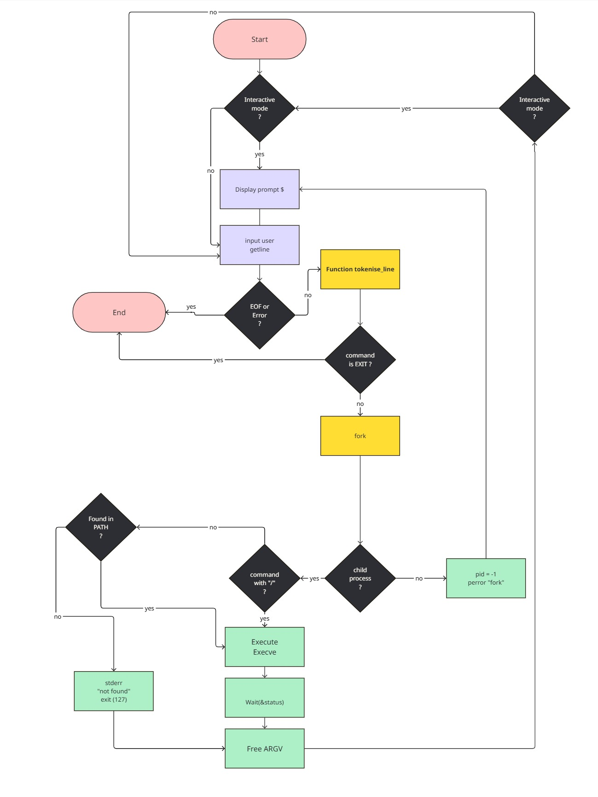

# hsh - Simple Shell

## Description

`hsh` is a basic reimplementation of a Unix shell written in C.  
It reads user input, parses it into commands and arguments, and executes them either using direct paths or by searching the executable in the directories defined by the `$PATH` environment variable.

## Compilation

To compile `hsh`, use the following command:

```sh
gcc -Wall -Werror -Wextra -pedantic -std=gnu89 *.c -o hsh
```

## Requirements

- Ubuntu 20.04 LTS or later  
- GCC (GNU Compiler Collection)  
- Basic knowledge of POSIX system calls (`fork`, `execve`, `wait`, etc.)

## Usage Examples

### Interactive Mode:
```sh
$ ./hsh
$ ls -l
$ /bin/echo Hello
$ exit
```

### Non-Interactive Mode:
```sh
$ echo "ls -l" | ./hsh
$ ./hsh < script.sh
```

## Features

- ✅ Command execution through `$PATH`
- ✅ Support for absolute and relative paths (`/bin/ls`, `./script`)
- ✅ Interactive mode (with `$` prompt)
- ✅ Non-interactive mode (with pipe or file input)
- ✅ Built-in `exit` command
- ✅ Proper memory management and cleanup
- ✅ Custom `_getenv()` function for reading environment variables

## File Structure

| File               | Description                                       |
|--------------------|---------------------------------------------------|
| `main.c`           | Shell loop and input handling                     |
| `main.h`           | Function prototypes and global variables (`environ`) |
| `execute_command.c`| Executes commands via `execve`                    |
| `tokenize_line.c`  | Splits input line into tokens (arguments)         |
| `_getenv.c`        | Retrieves environment variables manually          |

## Memory Leak Checks

Use `valgrind` to ensure proper memory usage:

```sh
valgrind --leak-check=full ./hsh
```

**Expected Output:**
```
==12345== All heap blocks were freed -- no leaks are possible
==12345== ERROR SUMMARY: 0 errors from 0 contexts (suppressed: 0 from 0)
```

## Flowchart

A flowchart visualizing the internal logic of the shell:

<div align="center">
  
</div>

## Collaborators

- **Boutin Victoire**
- **Pulon Julien**

_Last updated: 24/04/2025_
